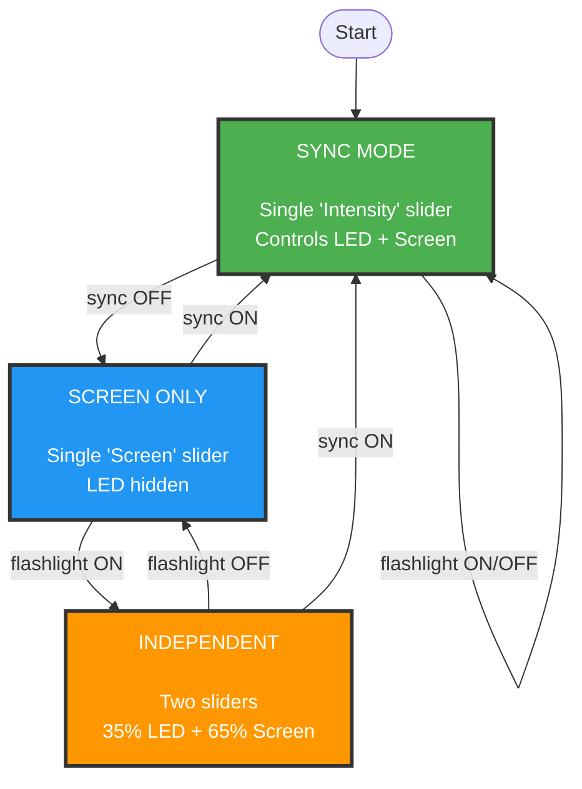

# Walklight - Safety Flashlight

**The smart safety light for outdoor walking and running.**

While holding your phone naturally, your hand movements leverage both the LED flashlight and screen to make sure you are visible to others. Perfect for evening walks, early morning runs, or any time you need safe, adaptable lighting that won't blind you or drain your battery.

**What makes Walklight special?** Unlike most flashlight apps, Walklight gives you intelligent dual control for both your phone's LED flashlight and screen brightness. Plus it's 100% free, open source, with no ads. 

## Screenshots


## Features

✅ **Smart dual lighting** - LED flashlight + screen brightness with precise intensity control  
✅ **Adaptive sync mode** - Control both lights together or independently as needed  
✅ **Three intelligent layouts** - Interface adapts to show only relevant controls  
✅ **Night vision friendly** - Fine intensity control prevents eye strain  
✅ **Walking optimized** - Designed for outdoor safety and comfort  
✅ **Free & Ad-Free** - No subscriptions, no ads, completely free to use  
✅ **Open Source** - MIT License, built with community transparency

## Technical Details

This is a native Android app built with:
- **Java** - Main development language
- **Android Camera2 API** - For flashlight control and intensity management
- **Material Design Components** - For modern UI elements
- **Target SDK: Android API 34** - Latest Android compatibility
- **Minimum SDK: Android API 26** - Supports Android 8.0+

## Device Compatibility

- ✅ **Samsung devices** - Full intensity control (1-5 brightness levels)
- ✅ **Google Pixel devices** - Standard intensity control (1-100 levels)
- ✅ **Other Android devices** - Auto-detection of capabilities with graceful fallbacks
- ✅ **Android emulators** - UI testing support (flashlight simulation)

## Status

🚀 **Production Release v1.18.15** - Ready for Play Store (Companion App Settings + Bug Fixes)

### Version History
- **v1.4.0** - **NEW ICON:** Person walking with dual safety lighting - clearly shows LED + screen functionality, perfect Walklight brand alignment
- **v1.3.2** - Polished unified light blue toggle design, perfect size consistency, superior UX discovery flow
- **v1.2** - Three-state adaptive layout (sync/independent/screen-only modes), intelligent UI that hides inactive controls, compact horizontal layout
- **v1.1** - Dual-slider system (LED + screen brightness), smooth operation, visual syncing, "Pay It Forward" icon  
- **v1.0** - Basic flashlight with intensity control and device compatibility

## How the Smart Layout System Works

Our app features an intelligent three-state layout system that adapts based on user context, showing only the controls you actually need:



**Why this matters:** Instead of cluttering the screen with disabled controls (like most apps), ours intelligently shows only what's functional. When the flashlight is off, why show a grayed-out LED slider? Our interface adapts to give you maximum precision where it counts.

## Development Procedures

### Version Bump Process

**Versioning Scheme: M.n.C**
- **M** = Major version (big architectural/UI changes, requires approval)  
- **n** = Minor version (new features, significant improvements)
- **C** = Code version (Play Store upload version, change only when publishing)

**Steps for Version Bump:**
```bash
# 1. Update version in app/build.gradle (e.g. 1.14.14 → 1.15.14)
# 2. Update README.md latest release version
# 3. Update NEXT_STEPS.md version references

# 4. Commit version changes
git add app/build.gradle README.md NEXT_STEPS.md
git commit -m "🎯 Version bump to 1.15.14 - [Description of changes]"

# 5. Create checkpoint tag
git tag v1.15.14
# OR for major milestones:
git tag checkpoint/[milestone-name]

# 6. Update recovery commands in NEXT_STEPS.md if needed
```

**Version Bump Rules:**
- **Minor features/improvements**: Increment `n` only (e.g., 1.14.14 → 1.15.14)
- **Major changes**: Increment `M`, reset `n` (requires approval)  
- **Play Store upload**: Increment `C` and `versionCode` (only when publishing)

## Development Credits

**Developed with AI Assistance** - This project was created with the assistance of Claude (Anthropic's AI assistant), providing:
- Complete Android app architecture and implementation
- Samsung device compatibility optimization
- Camera2 API integration and error handling
- Material Design UI implementation
- Device capability detection and graceful fallbacks

## License

View Only : you are welcome to inspect the source code but not to copy it.
