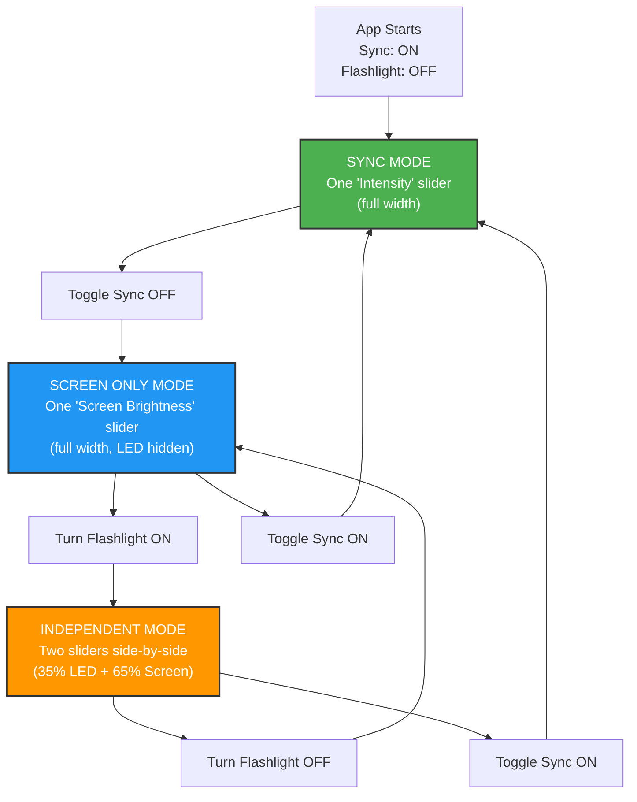

# Flashlight App

A simple native Android flashlight app with intensity control and colored display.

## Features

- **Basic flashlight on/off toggle** - Works on all Android devices with flashlight
- **Flashlight intensity control** - Automatic device capability detection (Samsung: 1-5 levels, others: 1-100)
- **Screen brightness feedback** - Visual intensity indicator with smooth brightness changes
- **Device compatibility** - Optimized for Samsung devices and other Android manufacturers
- **Clean Material Design UI** - Simple toggle button and intensity slider
- **Proper permissions handling** - Camera permission with user-friendly prompts
- **Free and ad-free** - No ads, no tracking, no premium features

## Technical Details

This is a native Android app built with:
- **Java** - Main development language
- **Android Camera2 API** - For flashlight control and intensity management
- **Material Design Components** - For modern UI elements
- **Target SDK: Android API 34** - Latest Android compatibility
- **Minimum SDK: Android API 26** - Supports Android 8.0+

## Device Compatibility

- ✅ **Samsung devices** - Full intensity control (1-5 brightness levels)
- ✅ **Google Pixel devices** - Standard intensity control (1-100 levels)
- ✅ **Other Android devices** - Auto-detection of capabilities with graceful fallbacks
- ✅ **Android emulators** - UI testing support (flashlight simulation)

## Status

✨ **Latest Release v1.2** - Smart Three-State Adaptive Layout System

### Version History
- **v1.2** - Three-state adaptive layout (sync/independent/screen-only modes), intelligent UI that hides inactive controls, compact horizontal layout, enhanced accessibility
- **v1.1** - Dual-slider system (LED + screen brightness), smooth operation, visual syncing, "Pay It Forward" icon  
- **v1.0** - Basic flashlight with intensity control and device compatibility

## How the Smart Layout System Works

Our app features an intelligent three-state layout system that adapts based on user context, showing only the controls you actually need:

**Why this matters:** Instead of cluttering the screen with disabled controls (like most apps), ours intelligently shows only what's functional. When the flashlight is off, why show a grayed-out LED slider? Our interface adapts to give you maximum precision where it counts.

## Development Credits

**Developed with AI Assistance** - This project was created with the assistance of Claude (Anthropic's AI assistant), providing:
- Complete Android app architecture and implementation
- Samsung device compatibility optimization
- Camera2 API integration and error handling
- Material Design UI implementation
- Device capability detection and graceful fallbacks

## License

Free and open source
